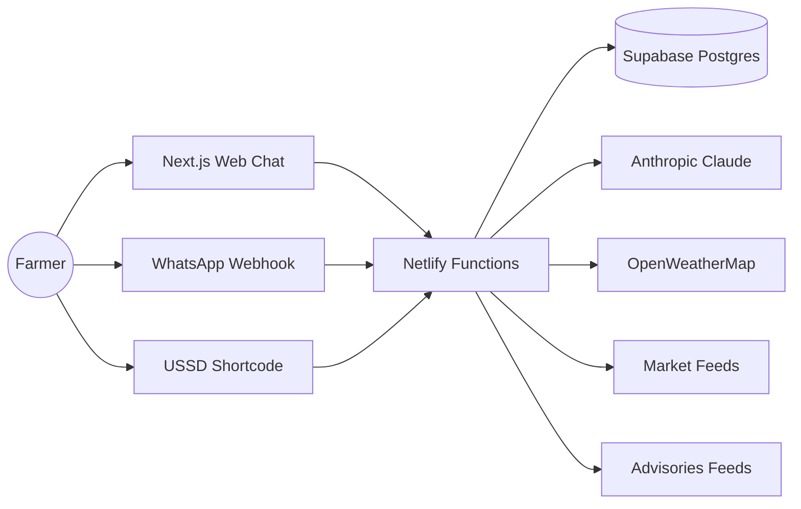

# FarmVoice AI

FarmVoice AI is a conversational agricultural extension agent for African smallholder farmers. It serves farmers through web chat, WhatsApp, and USSD so it can work on smartphones and feature phones alike.

## Problem

Hundreds of millions of smallholder farmers still lack timely access to extension officers, price signals, climate warnings, and finance referrals. That gap leads to lower yields, poor input decisions, and avoidable crop losses.

## Solution

FarmVoice AI provides practical, localised advice in English, Hausa, Yoruba, Swahili, and French. It combines live weather, market prices, pest and disease advisories, and loan referrals into a single conversational experience.

## Architecture



### Repository Layout

- [farmvoice-frontend](farmvoice-frontend) - Next.js 14 App Router frontend deployed to Vercel.
- [farmvoice-backend](farmvoice-backend) - Netlify Functions backend deployed to Netlify.

## Key Endpoints

| Method | Path | Purpose |
| --- | --- | --- |
| POST | `/.netlify/functions/auth/register` | Register a farmer profile |
| POST | `/.netlify/functions/auth/login` | Look up a farmer profile |
| POST | `/.netlify/functions/chat` | Core AI chat pipeline |
| POST | `/.netlify/functions/whatsapp` | Twilio WhatsApp webhook |
| POST | `/.netlify/functions/ussd` | Africa's Talking USSD webhook |
| GET | `/.netlify/functions/market` | List market prices |
| POST | `/.netlify/functions/market` | Add a market price record |
| GET | `/.netlify/functions/weather/:lat/:lng` | Forecast plus agronomic advice |
| GET | `/.netlify/functions/advisories` | List active advisories |
| POST | `/.netlify/functions/advisories` | Create an advisory |
| GET | `/.netlify/functions/loans/:country` | List loan products |
| GET | `/.netlify/functions/analytics` | Admin dashboard stats |
| POST | `/.netlify/functions/feedback` | Submit farmer feedback |

## USSD Flow

```text
Level 0
Welcome to FarmVoice AI
1. Ask a question
2. Market prices
3. Weather forecast
4. Loan options
5. Change language

Level 1
1 -> Type your farming question -> answer from chat pipeline
2 -> Select crop -> show local market prices
3 -> Show weather forecast for the farmer's location
4 -> List top 3 loan products for the country
5 -> Change language
```

## WhatsApp Setup

1. Create a Twilio WhatsApp sandbox or approved sender.
2. Point the webhook to `/.netlify/functions/whatsapp` on the deployed backend.
3. Set `TWILIO_SID`, `TWILIO_AUTH_TOKEN`, and `TWILIO_WHATSAPP_NUMBER` in the Netlify environment.
4. Send text or crop photos and the bot will reply with context-aware advice.

## Environment Variables

| Variable | Used In | Purpose |
| --- | --- | --- |
| `SUPABASE_URL` | Backend | Supabase project URL |
| `SUPABASE_SERVICE_KEY` | Backend | Service role key for database writes |
| `OPENROUTER_API_KEY` | Backend | OpenRouter model access |
| `OPENROUTER_MODEL` | Backend | Defaults to `nvidia/nemotron-3-super-120b-a12b:free` |
| `OPENROUTER_APP_URL` | Backend | Referer header for OpenRouter |
| `OPENROUTER_APP_NAME` | Backend | App title sent to OpenRouter |
| `OPENWEATHERMAP_API_KEY` | Backend | Weather forecasts and geocoding |
| `TWILIO_SID` | Backend | WhatsApp messaging |
| `TWILIO_AUTH_TOKEN` | Backend | WhatsApp webhook signature checks |
| `TWILIO_WHATSAPP_NUMBER` | Backend | WhatsApp sender number |
| `AFRICASTALKING_API_KEY` | Backend | USSD/telecom integration |
| `AFRICASTALKING_USERNAME` | Backend | Africa's Talking username |
| `AFRICASTALKING_SHORTCODE` | Backend | USSD shortcode |
| `NEXT_PUBLIC_BACKEND_URL` | Frontend | Base URL for Netlify Functions |
| `VERCEL_TOKEN` | GitHub Actions | Frontend deployment token |
| `NETLIFY_AUTH_TOKEN` | GitHub Actions | Backend deployment token |
| `NETLIFY_SITE_ID` | GitHub Actions | Netlify site identifier |

## Local Development

### Backend

```bash
cd farmvoice-backend
npm install
npm test
```

### Frontend

```bash
cd farmvoice-frontend
npm install
npm run dev
```

Set `NEXT_PUBLIC_BACKEND_URL` to the deployed backend URL or a local proxy before using the web chat.

## Deployment

1. Deploy the backend to Netlify Functions.
2. Configure the WhatsApp webhook, USSD shortcode, and scheduled function settings.
3. Deploy the frontend to Vercel.
4. Set the frontend environment variable `NEXT_PUBLIC_BACKEND_URL` to the Netlify deployment URL.

## Grant Alignment

FarmVoice AI fits funding programs focused on climate resilience, food security, financial inclusion, and rural productivity, including:

- Gates Foundation
- USAID Feed the Future
- CGIAR
- Rockefeller Food Initiative
- Tony Elumelu Foundation

The product improves access to extension services, reduces crop losses, and supports more informed input and market decisions for smallholders.
